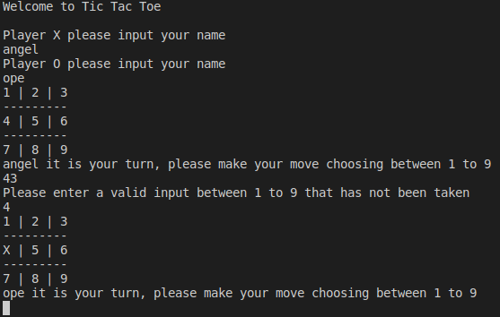

# Tic Tac Toe

> Microverse Object Oriented Programming Ruby Tic Tac Toe game.

This project required to use Object Oriented Design to follow good practices in programming, such as:

- DRY (Don't Repeat Yourself)
- Single Responsibility Rule (a class does one only thing)
- No classes or methods on executable file

## Built With

- Ruby
- Rubocop

## Rules

- 3 x 3 grid as board
- First player is X, second player is O. Players put their marks in numbered squares.
- First player to get 3 of her marks in a row (up, down, across, or diagonally) wins.
- 9 squares full mean the game is over. If no winner, it's a draw.

## Flow

- Player's name asked
- Board displayed before each player marks a cell to check current game status.
- Players mark available cell by entering its number.
- Game over i there is a winner or a tie after each turn.

## Getting Started

To get a local copy up and running follow these simple example steps.

- Create a local clone of the repo.
- Run it through `main.rb` in your terminal.

## Authors

👤 **Opeyemi Oyelesi**

- Github: [Opeyemi Oyelesi](https://github.com/githubhandle)
- Linkedin: [Opeyemi Oyelesi](https://www.linkedin.com/in/opeyemioyelesi/)

👤 **Angel Mora**

- Github: [Angel Mora](https://github.com/angel-mora)
- Linkedin: [Angel Mora](https://www.linkedin.com/in/angelmoma/)

## 🤝 Contributing

Contributions, issues and feature requests are welcome!

Feel free to check the [issues page](issues/).

## Show your support

Give a ⭐️ if you like this project!

## Acknowledgments

- Thanks to Microverse and its awesome community

## 📝 License

This project is [MIT](https://opensource.org/licenses/MIT) licensed.
